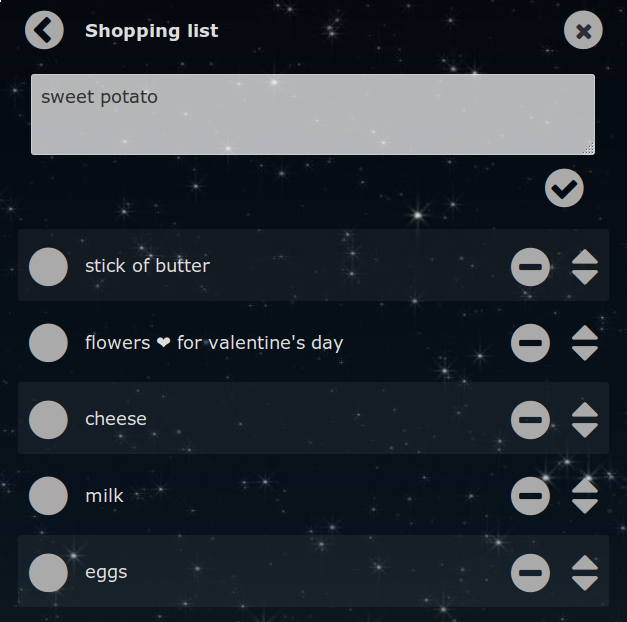

Minimal TODO list web app:

 * Web based.
 * Easy to deploy.
 * Self-hosted & FLOSS.
 * Allows multiple people to update a list.
 * Mobile friendly - "Add to Home Screen" webapp.
 * Simple text based format for easy editing (see below).

Surprisingly, I could not find software meeting these criteria.

### Hosted Install

[Get a fully hosted todoMini](https://www.todomini.app/).

### Self-hosted Install

 * Download [a release](https://github.com/chr15m/omgnata/releases) or `git clone` the `gh-pages` branch.
 * Copy the files to your PHP web hosting.

Note: ensure that the `data/` directory and files therein are writable by the user/group running PHP.

[If you use todoMini, please give it a 'like' on alternativeto.net](https://alternativeto.net/software/todomini/)

### Authentication

To require authentication, first create a password file:

	htpasswd -c /path/to/.htpasswd username

Then copy `./example.htaccess` to `.htaccess` and edit it.

### Multi-user

If you have multiple users, clone the directory for each user and create a unique htaccess login for each.

To create a shared list, symlink one of the TODO list files into each user's data directory.

### Textfile format

The TODO lists use standard Markdown format:

	 * [x] This is my first completed item.
	 * [ ] Another uncompleted item.
	 * [ ] Something else.

### License

Copyright Chris McCormick, 2016. [GPLv3 licensed](./LICENSE.txt).
